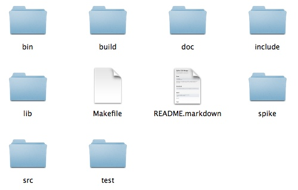

# Coding Guideline for MoneyTracker application 
## Authors : Maria Bercean, Catalin Sas, Daniel Malina

###1.	Indentation

		- Basic indentations should be 1 tab or 4 spaces.
		 	**EXAMPLE**
			```
			while (!done) {
				doSomething();
				done = moreToDo();
			}
			```
			
		- Line length should be maximum 80 characters. 
		
###2.	Whitespace

		- Conventional operators should be surrounded by a space character. 
			**EXAMPLE**
			```
			for (i = 0; i < nElements; i++)
			```
			
		- C++ reserved words should be followed by a white space. 
			**EXAMPLE**
			```
			if (condition) {
				statements;
			}
			```
			
		- Commas should be followed by a white space. 
			**EXAMPLE**
			```
			computeDistance(average, x, y, z)
			```
			
		- Colons should be followed by a white space. 
			**EXAMPLE**
			```
			class SomeClass : public BaseClass
			```
			
		- Semicolons in for statments should be followed by a space character.
			**EXAMPLE**
			```
			for (initialization; condition; update)
			```
			
###3.	Empty lines

		- Leave an empty line between groups of include statements.
			**EXAMPLE**
			```
			#include <fstream>
			#include <iomanip>

			#include <qt/qbutton.h>
			#include <qt/qtextfield.h>
			```
		- Leave an empty line between function implementations.
			**EXAMPLE**
			```
			int getValue()   
			{
			  ...
			}
			
			int getValue()   
			{
			  ...
			}
			```
		
		- Leave an empyt line between state and behaviour members of a class.
			**EXAMPLE**
			```
			class MyClass
			{
			public:
			  int getValue ();  
			  ...

			private:
			  int value_;
			}
			```
			
		
		
		
###4.	Split lines

		- The incompleteness of split lines must be made obvious
			- Break after a comma.
			- Break after an operator.
			- Align the new line with the beginning of the expression on the 
				previous line.
			**EXAMPLE**
			```	
			for (int tableNo = 0; tableNo < nTables;
				tableNo += tableStep) {
				...
			}
			```
			
###5.  Brackets

		- when used in block layout the opening bracket should be in the same 
			line but separated with a white space
			**EXAMPLE**
			```
			try {
				statements;
			}
			catch (Exception& exception) {
				statements;
			}
			```
			
		- when used in class and function definition the opening bracket 
			should be in a new line but without indentation 
			**EXAMPLE**
			```
			void MyClass::myMethod(void)
			{
				...
			}
			```
			
		- in all cases the closing bracket should be on a new line and without
			indentation in respect to the current block (as seen above)


###6.	Naming convention

		- Abbreviations in names should be avoided.
			**EXAMPLE**
			```
			computeAverage();   // NOT: compAvg();
			```
			
		- Names shold be suggestive
			**EXAMPLE**
			```
			void printPriceEarningRatio();   // NOT: void printPER();
			```
			
		- Type names must be in mixed case starting with upper case.
			**EXAMPLE**
			```
			SavingsAccount :: getSavings ();  
			```
		- Variable names must be in mixed case starting with lower case.
			**EXAMPLE**
			```
			savingsAccount;   // NOT: savingsaccount;
			```
		- Private class variables should have underscore suffix.
			**EXAMPLE**
			```
			class SomeClass {
				private:
					int length_;
			}
			```
		- Names representing methods or functions must be verbs and written 
			in mixed case starting with lower case.
		- Non-generic variables that have a role should be named by combining 
			the role and the type
			**EXAMPLE**
			```
			computeAverage();
			```
			
		- Named constants (including enumeration values) must be all uppercase 
			using underscore to separate words. (defined, global...)
			the role and the type
			**EXAMPLE**
			```
			#typedef MAX_SIZE 50
			const int MAX_LENGTH = 100;
			```
			
		- All names should be written in English.
		- The terms get/set must be used where an attribute is accessed directly.
		- Plural form should be used on names representing collections.
			**EXAMPLE**
			```
			std::list<MyObject> myobjects; 
			```
			
		- Where possible variables should be named for general purpose not 
			context specific 
		
###7.	Commnets
		
		- The code should be self-documenting by appropriate name choices and 
			an explicit logical structure, so that minimal commenting will be 
			required
		- All comments should be written in English.
		- Use // for all comments, including multi-line comments.
		- Comments line length should not exceed 80 characters.
		- Comments for functions should be placed in the header file before 
			the function prototype
			**EXAMPLE**
			```
			//constructor
			//creates game with empty board and selects 
			//the first player
			TicTacToe(const Player_E firstPlayer); 
			```
		
###8.	Files separation

		- The application should be structured in modules representing 
			different functionalities
			
			
		- Separate files for prototypes and implementations should be used
		
		
#### For more examples of code click here [link](http://geosoft.no/development/cppstyle.html)
		
		
		
